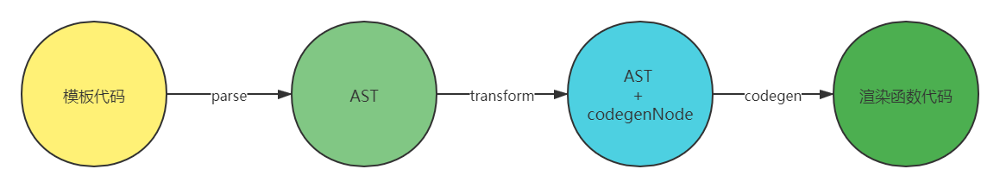
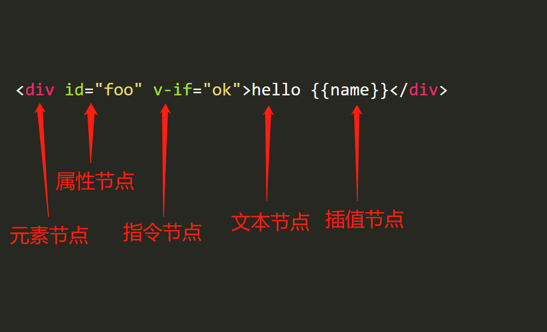

# Vue 模板编译

## 编译的目的

将 `vue` 模板代码编译为渲染函数
https://vue-next-template-explorer.netlify.app/

## 编译的步骤



### parse

原始的模板代码就是一段字符串，通过解析 `parse` 转换为原始 `AST` 抽象语法树。

### transfrom

`AST` 经过 `transfrom`，生成一个 `codegenNode`。`codegenNode` 是 `AST` 到生成渲染函数代码的中间步骤，它由解析原始 `AST` 的语义而得来。
比如对于原始 `AST` 来说，

```html
<div v-if="ok" />
<div id="ok" />
```

没有什么区别，都是一个元素，带有一个不同的属性而已。然而 `v-if` 是带有特殊语义的，不能像一般的纯元素节点一样采用同样的代码生成方式。
`transform` 的作用就在于此，一方面解析原始 `AST` 的语义，另一方面要为生成代码做准备。因此这一部分也是整个 `vue compiler` 模块中最复杂的部分。

### codegen

即是 code generate。遍历 `codegenNode`，递归地生成最终的渲染函数代码。

## Mini-Vue 的 compiler 实现原则

1. 只实现能够支撑流程跑通的最基本的功能
2. 舍弃所有的优化手段，选项功能
3. 假定所有的输入都是合法的（不做任何的语法容错处理）
4. 为了减少代码量，某些地方会使用一些与源码差别很大的简化手段
5. 会舍弃一些非常麻烦的实现

## parse 的实现

### 认识 AST

```html
<div id="foo" v-if="ok">hello {{name}}</div>
```



### AST Node 的类型

```javascript
const NodeTypes = {
  ROOT: 'ROOT',
  ELEMENT: 'ELEMENT',
  TEXT: 'TEXT',
  SIMPLE_EXPRESSION: 'SIMPLE_EXPRESSION',
  INTERPOLATION: 'INTERPOLATION',
  ATTRIBUTE: 'ATTRIBUTE',
  DIRECTIVE: 'DIRECTIVE',
};

const ElementTypes = {
  ELEMENT: 'ELEMENT',
  COMPONENT: 'COMPONENT',
};
```

1. 根节点

```javascript
{
  type: NodeTypes.ROOT,
  children: [],
}
```

2. 纯文本节点

```javascript
{
  type: NodeTypes.TEXT,
  content: string
}
```

3. 表达式节点

```javascript
{
  type: NodeTypes.SIMPLE_EXPRESSION,
  content: string,
  // 表达式是否静态。静态可以理解为content就是一段字符串；而动态的content指的是一个变量，或一段js表达式
  isStatic: boolean,
}
```

4. 插值节点

```javascript
{
  type: NodeTypes.INTERPOLATION,
  content: {
    type: NodeTypes.SIMPLE_EXPRESSION,
    content: string,
    isStatic: false,
  } // 表达式节点
}
```

5. 元素节点

```javascript
{
  type: NodeTypes.ELEMENT,
  tag: string, // 标签名,
  tagType: ElementTypes, // 是组件还是原生元素,
  props: [], // 属性节点数组,
  directives: [], // 指令数组
  isSelfClosing: boolean, // 是否是自闭合标签,
  children: [],
}
```

6. 属性节点

```javascript
{
  type: NodeTypes.ATTRIBUTE,
  name: string,
  value: undefined | {
    type: NodeTypes.TEXT,
    content: string,
  } // 纯文本节点
}
```

7. 指令节点

```javascript
{
  type: NodeTypes.DIRECTIVE,
  name: string,
  exp: undefined | {
    type: NodeTypes.SIMPLE_EXPRESSION,
    content: string,
    isStatic: false,
  }, // 表达式节点
  arg: undefined | {
    type: NodeTypes.SIMPLE_EXPRESSION,
    content: string,
    isStatic: true,
  } // 表达式节点
}
```

#### 指令节点

```html
<div v-bind:class="myClass" />

<div @click="handleClick" />
```

name: bind, arg: class, exp: myClass

name: on, arg: click, exp: handleClick

#### 示例的最终结果

`<div id="foo" v-if="ok">hello {{name}}</div>`

```json
{
  "type": "ROOT",
  "children": [
    {
      "type": "ELEMENT",
      "tag": "div",
      "tagType": "ELEMENT",
      "props": [
        {
          "type": "ATTRIBUTE",
          "name": "id",
          "value": { "type": "TEXT", "content": "foo" }
        }
      ],
      "directives": [
        {
          "type": "DIRECTIVE",
          "name": "if",
          "exp": {
            "type": "SIMPLE_EXPRESSION",
            "content": "ok",
            "isStatic": false
          }
        }
      ],
      "isSelfClosing": false,
      "children": [
        { "type": "TEXT", "content": "hello " },
        {
          "type": "INTERPOLATION",
          "content": {
            "type": "SIMPLE_EXPRESSION",
            "isStatic": false,
            "content": "name"
          }
        }
      ]
    }
  ]
}
```

##### 简化手段

不支持文本节点中带有'<'符号

##### 正则

```javascript
// parseTag
/^<\/?([a-z][^\t\r\n\f />]*)/i

// advanceSpaces
/^[\t\r\n\f ]+/

// parseAttribute
/^[^\t\r\n\f />][^\t\r\n\f />=]*/
```

#### whitespace优化

```html
<!-- <div>
  foo

      bar
</div> -->

<div>
  <span>a</span>
  <span>b</span>
  <span>c</span>
</div>
```

```javascript
let removedWhitespace = false;
for (let i = 0; i < nodes.length; i++) {
  const node = nodes[i];
  if (node.type === NodeTypes.TEXT) {
    // 全是空白的节点
    if (!/[^\t\r\n\f ]/.test(node.content)) {
      const prev = nodes[i - 1];
      const next = nodes[i + 1];
      if (
        !prev ||
        !next ||
        (prev.type === NodeTypes.ELEMENT &&
          next.type === NodeTypes.ELEMENT &&
          /[\r\n]/.test(node.content))
      ) {
        removedWhitespace = true;
        nodes[i] = null;
      } else {
        // Otherwise, the whitespace is condensed into a single space
        node.content = ' ';
      }
    } else {
      node.content = node.content.replace(/[\t\r\n\f ]+/g, ' ');
    }
  }
}
```
