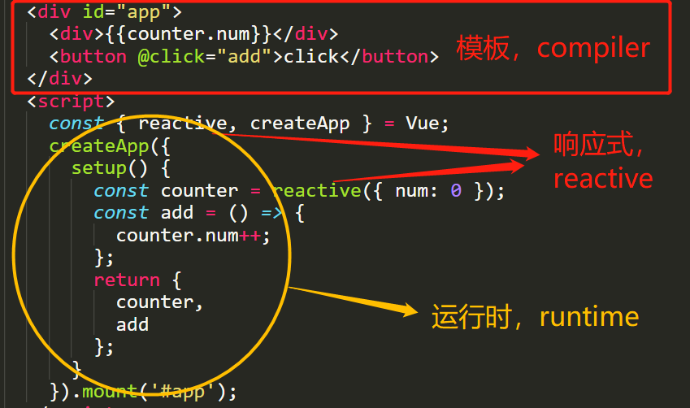

# 从零开始写 mini-vue

## 项目初衷

现在市面上有非常多的“vue3 源码解读”资料，但我感觉都讲的都不够全面，除了@HcySunYang 大大的[vue-design](http://hcysun.me/vue-design/zh/)，质量非常高，但可惜只重点讲了虚拟 dom 和 diff 算法，其他方面没有涉及。
市面上也有非常多的`mini-vue`项目，但实现的完整度也不高。
所以我们今天决定从零开始实现一个**与众不同**的`mini-vue`。
即然说要**与众不同**，那就要定下几个目标：

1. 与 vue3 源码结构尽量相同
2. 完整度要高，尽量能模拟 vue3 的真实流程
3. 能跑通 vue3 的一些基础用例
4. 用尽量少的代码实现，只做主线任务，跳过支线任务

## 先熟悉一下 vue3 源码结构

vue3 源码分为三大模块：`runtime`，`compiler`，`reactive`

看下面一个简单的例子：

```html
<div id="app">
  <div>{{counter.num}}</div>
  <button @click="add">click</button>
</div>
<script>
  const { reactive, createApp } = Vue;
  createApp({
    setup() {
      const counter = reactive({ num: 0 });
      const add = () => {
        counter.num++;
      };
      return {
        counter,
        add
      };
    }
  }).mount('#app');
</script>
```



这里面最重要的是runtime和reactive，有了这两个东西，如果你熟悉渲染函数的话，直接就可以用渲染函数来写应用了。是的，`template`的作用，就是将模板编译为渲染函数。

了解了这些基础以后，就可以决定我们的编写顺序了。我们会按`reactive` > `runtime` > `compiler` 的顺序去完成`mini-vue`。
