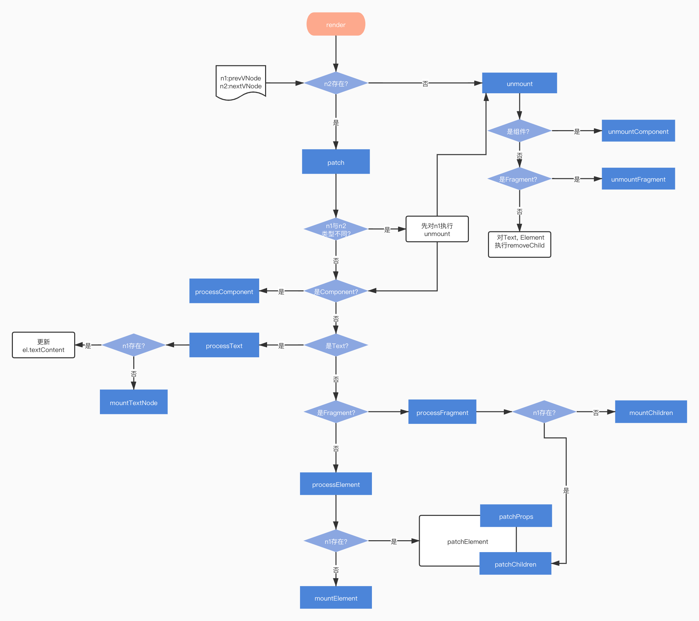

# patch

`patch` 是什么？
`Reconciliation`
diff 算法

## patch 流程图



## 改造 render 函数

改造 render 函数，使之能存储 prevVNode

## vnode 添加 el 属性

## patchChildren


vue 源码的 `patchChildren` 结构

```javascript
if (shapeFlag & ShapeFlags.TEXT_CHILDREN) {
  if (prevShapeFlag & ShapeFlags.ARRAY_CHILDREN) {
    unmountChildren(c1);
  }
  if (c2 !== c1) {
    container.textContent = c2;
  }
} else {
  // c2 is array or null

  if (prevShapeFlag & ShapeFlags.ARRAY_CHILDREN) {
    // c1 was array

    if (shapeFlag & ShapeFlags.ARRAY_CHILDREN) {
      // c2 is array
      // patchArrayChildren()
    } else {
      // c2 is null
      unmountChildren(c1);
    }
  } else {
    // c1 was text or null

    if (prevShapeFlag & ShapeFlags.TEXT_CHILDREN) {
      container.textContent = '';
    }
    if (shapeFlag & ShapeFlags.ARRAY_CHILDREN) {
      mountChildren(c2, container, anchor);
    }
  }
}
```

## patchArrayChildren

```javascript
const n1 = h('ul', null, [
  h('li', null, 'a'),
  h('li', null, 'b'),
  h('li', null, 'c'),
]);

const n2 = h('ul', null, [
  h('li', null, 'd'),
  h('li', null, 'e'),
  h('li', null, 'f'),
]);
```

> c1: a b c
> c2: d e f

> c1: a b c
> c2: d e f g h

> c1: a b c g h
> c2: d e f

## Fragment 的问题

```javascript
render(
  h('ul', null, [
    h('li', null, 'first'),
    h(Fragment, null, []),
    h('li', null, 'last'),
  ]),
  document.body
);
setTimeout(() => {
  render(
    h('ul', null, [
      h('li', null, 'first'),
      h(Fragment, null, [h('li', null, 'middle')]),
      h('li', null, 'last'),
    ]),
    document.body
  );
}, 2000);
```

middle 被放在了最后面。
原因是在 `mountElement` 中，使用了 `container.appendChild`

## 添加 anchor 属性

anchor 是 Fragment 的专有属性
只有 `unmount`、`patchElement`、`mountElement` 中的 `mountChildren` 不需要 anchor

另外，在 `patch` 的 `unmount(n1)` 中，需要重设 anchor。

> h1, h1, h1
> h1, h2, h1

例如，对上面这个例子进行 `patchChildren`
第一次 `patch` 时，`n2.el = n1.el`，没有创建元素，anchor 没有用。
第二次 `patch` 时，先删除了 n1，对 n2 进行创建，执行`insertBefore`，anchor 就需要设置为 n1 的下一个兄弟节点。

> h1, "" h1 "", h1
> h1, h2, h1

如果 n1 是 Fragment，那么 anchor 应该设置为 n1 的 anchor 的下一个兄弟节点。
