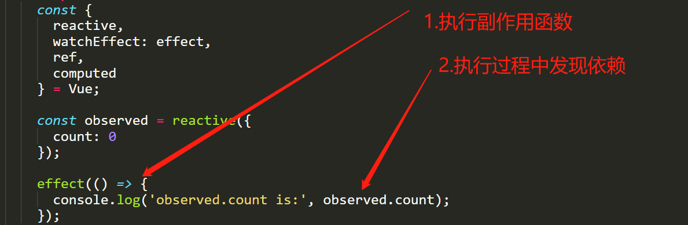
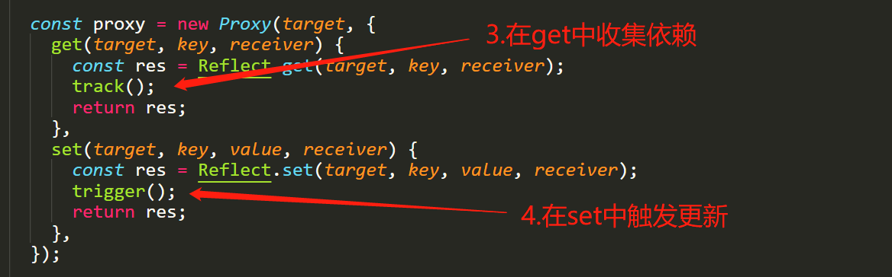

# reactive

## 先熟悉一下 vue3 的响应式代码

```javascript
const { reactive, watchEffect: effect, ref, computed } = Vue;

const observed = reactive({
  count: 0,
});

effect(() => {
  console.log('observed.count is:', observed.count);
});
```

先忽略`watchEffect`，在这里它就等同于`effect`。
`reactive`建立了一个响应式对象，它与`effect`建立联系。
当`effect`函数执行时，里面用到的所有响应式对象都会自动建立依赖关系，当这些依赖更新时，`effect`会重新执行。

## 项目结构

在开始动代码之前，先简单解介绍一下项目结构。它非常简单

```javascript
// webpack.config.js
module.exports = {
  mode: 'development',
  devtool: 'inline-cheap-source-map',
  entry: './src/index.js',
  output: {
    filename: 'mini-vue.js',
    path: path.resolve(__dirname, 'dist'),
    clean: true,
  },
  devServer: {
    contentBase: './src/examples',
    publicPath: '/dist',
    watchContentBase: true,
  },
};
```

`src/index.js`是入口文件，我们的目标是写一个库，将来会把库打包成`mini-vue.js`，输出到`dist`目录中。
`src/examples`目录存放示例 html 代码，就像引用`vue.global.js`一样，引入`dist/mini-vue.js`，就可以工作了。`devServer`的配置就是为支持这样的开发工作。
我们可以先试一下

```bash
npm run build
```

可以看到，`src/index.js`中的代码被打包进了`dist`目录中。那我们就启用

```bash
npm run dev
```

开始开发吧。


## reactive与effect

reactive与effect是怎样建立联系的呢？
核心就是要进行依赖收集`track`和触发更新`trigger`。
依赖收集，就是要保存副作用与它的依赖的关系。
触发更新，就是当依赖变更时，找到并执行依赖于它的副作用。
显然，应该在reactive的get中执行`track`，set中执行`trigger`。

reactive与effect建立联系的4个步骤：
1. 执行副作用函数
2. 执行过程中发现依赖，对响应式对象的依赖
3. 响应式对象中进行依赖收集
4. 响应式对象发生变化时触发更新




##targetMap

targetMap用于存储副作用，并建立副作用和依赖的对应关系。

一个副作用可能依赖多个响应式对象，也可能依赖一个响应式里的多个属性。
而一个属性又可能被多个副作用依赖，因此targetMap的结构设计如下。

```javascript
{ // 这是一个WeakMap
  [target]: { // key是reactiveObject, value是一个Map
    [key]: [] // key是reactiveObject的键值, value是一个Set
  }
}
```

使用WeakMap的原因：当reactiveObject不再使用后，不必手动去WeakMap里删除，垃圾回收系统可以自动回收。


## 特例处理

1. `reactive(reactive(obj))`
2. `let a = reactive(obj), b = reactive(obj)`
3. `hasChanged`
4. 深层对象代理
5. 数组
6. 嵌套effect

## computed

computed与effect很像，但又有两个不同点
1. effect中的副作用会立即执行，但computed不会
2. computed的依赖变量时，不会去执行getter函数，而会是去执行一个调度函数。在调度函数中置_dirty为false
